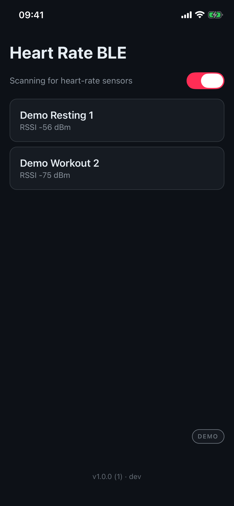
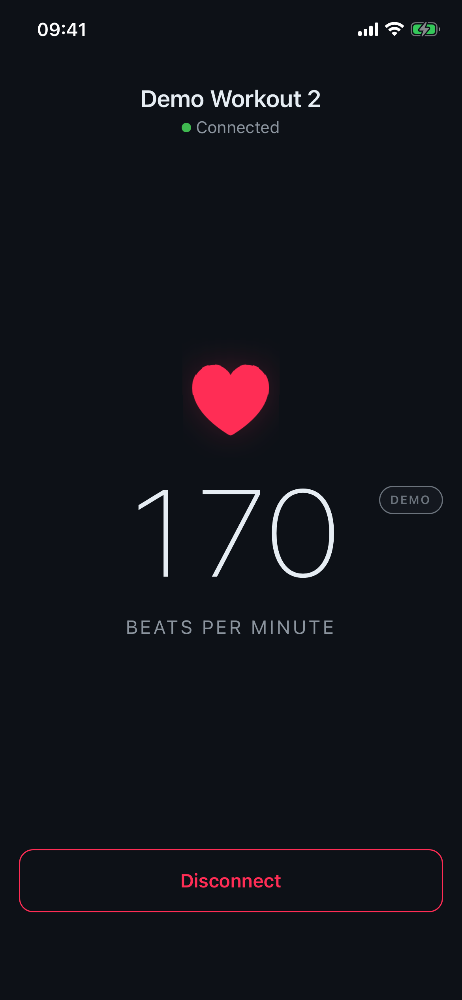

# Heart Rate BLE

Live heart rate from any standard Bluetooth Low Energy heart-rate sensor — a
React Native (Expo) app, verified end-to-end with a Garmin watch
broadcasting heart rate.

<p>
  
  &nbsp;&nbsp;
  
</p>

*Simulator screenshots using the built-in demo sensor; the same UI runs
against real hardware.*

## Try it

**With a sensor:** put a watch or strap in broadcast mode (e.g. Garmin's
*Broadcast Heart Rate*), open the app, tap the sensor when it appears.
Distribution is via TestFlight (internal group).

**Without hardware:** summon a demo device (**Demo HRM n**) — a virtual
sensor that advertises and streams synthetic ~1 Hz heart rate through the
exact same interface and staleness rules as real hardware, so the full
flow works on any simulator. Until the on-device demo surface lands, use
`demoMonitor.summon()` from the dev-client debugger console.

## How it works

The two screens sit on BLE's two data paths: the scan list is fed by
connectionless *advertisements* (identity + signal strength, never the
heart rate), the live screen by *GATT notifications* after connecting and
subscribing to the standard Heart Rate Measurement characteristic.
[docs/ble-primer.md](docs/ble-primer.md) explains this in one page.

## Architecture

```
src/ble/HeartRateMonitor.ts        the seam: scan / connect / samples
├── BleHeartRateMonitor.ts         real sensors (react-native-ble-plx),
│                                  bounded auto-reconnect on drops
├── DemoHeartRateMonitor.ts        summoned virtual sensors (demo mode)
└── parseHeartRateMeasurement.ts   spec-complete 0x2A37 parser

src/store/heartRateStore.ts        Zustand vanilla store (factory, DI):
                                   scan lifecycle rule + staleness timing
src/screens/                       thin components, subscribe via selectors
```

Everything time-dependent — when scanning runs, when a silent sensor greys
out in the list — lives in the store, outside React, and is unit-tested
with fake timers and an injected fake monitor (no mocking framework):
`npm test`.

[docs/design-notes.md](docs/design-notes.md) records why each decision fell
the way it did.

## Development

```bash
npm install
npx expo run:ios --device   # dev client; BLE needs a physical device
```

- **Expo SDK 54, pinned** — the `react-native-ble-plx` config plugin breaks
  on SDK 57.
- **New architecture disabled** — ble-plx crashes Release builds on new
  arch ([dotintent/react-native-ble-plx#1278](https://github.com/dotintent/react-native-ble-plx/issues/1278)).
- The iOS **simulator has no Bluetooth** — you get the demo sensor there;
  real scanning needs a device.
- Releases: EAS build → TestFlight; JS-only changes ship over the air with
  `eas update` (the version footer shows binary + OTA bundle).

## Scope and known limitations

Deliberate cuts to keep the core lean: no picture-in-picture, no charts or
session history, no Android verification (the code is cross-platform, only
iOS is tested). Known rough edge: a failed connect attempt currently gives
no user feedback ([#13](https://github.com/dirkpostma/heart-rate-ble/issues/13)).

## How this was built

Built in a few days as an agent-driven project: a
[wayfinder map](https://github.com/dirkpostma/heart-rate-ble/issues/1)
charts the destination and breaks the fog into tickets — research,
prototypes, implementation tasks — each resolving one decision, with the
answer recorded on the ticket. Claude (Claude Code) drove research,
implementation and releases; the human set direction, made the calls on the
tickets, and verified everything on real hardware. The map's
"Decisions so far" index is the project's memory.

## Contributing

The process above isn't just history — it's how the project keeps working.
The code shows *what*; the record shows *why*. Contributions are welcome as
long as both stay true.

**Read the record before changing things.** Every non-obvious choice in
this codebase was settled on a ticket, with the reasoning in a resolution
comment. Start at the map's
[Decisions so far](https://github.com/dirkpostma/heart-rate-ble/issues/1)
index and follow the link; if a decision looks wrong, argue with the ticket
that made it, not with a silent revert.

Where the documentation lives:

| What | Where |
|---|---|
| Decision index | The [wayfinder map](https://github.com/dirkpostma/heart-rate-ble/issues/1) — one line per closed ticket |
| Full reasoning per decision | Resolution comments on the closed tickets under the map |
| Design rationale (narrative) | [docs/design-notes.md](docs/design-notes.md) |
| Research summaries | [docs/research/](docs/research/) (BLE profile, Expo + ble-plx setup) |
| UI prototypes | [docs/prototype/](docs/prototype/) |
| Instructions for coding agents | [AGENTS.md](AGENTS.md) (loaded by Claude Code via CLAUDE.md) |

**To propose a change**, open an issue framed as the *question* it resolves
rather than a finished solution — that's the shape every decision here
already has. If it overturns an earlier decision, link the ticket that made
it and say what changed. Small obvious fixes can skip straight to a PR.

**Which process, when.** The workflow here comes from
[Matt Pocock's skills](https://github.com/mattpocock/skills); match the
weight of the process to the fog, not the size of the diff:

- **`/wayfinder`** — for work too big for one agent session *and* whose
  route is still foggy: several interdependent decisions, no clear order.
  It charts a map and resolves one decision per ticket. This project's
  [map](https://github.com/dirkpostma/heart-rate-ble/issues/1) came from
  exactly that.
- **A single skill session** — when there's one sharp question:
  `/grilling` to stress-test an idea, `/research` when the answer lives
  outside the repo, `/prototype` when "how should it look or behave" is
  the question. The answer still lands on an issue.
- **No process** — a small fix, a docs tweak, a rename: just do it and
  open a PR. A map for a one-decision change is overkill; the record it
  would produce is the diff itself.

**Working with an agent is the norm here, not the exception.** Whether you
drive Claude Code or type by hand, the bar is the same: the diff carries
the change, the issue carries the decision and its why. An agent session
that lands code without leaving a record has done half the job.

Practical guardrails:

- `npm test` must pass; the timing rules live in the store and are tested
  with fake timers and an injected fake monitor — extend that suite rather
  than adding a mocking framework.
- Respect the two load-bearing pins (SDK 54, old architecture) — see
  [Development](#development) for why.
- JS-only changes ship over the air with `eas update`; anything touching
  native code or config needs a new EAS build. Builds are deliberate and
  quota-limited — flag the need in the issue instead of assuming one.
